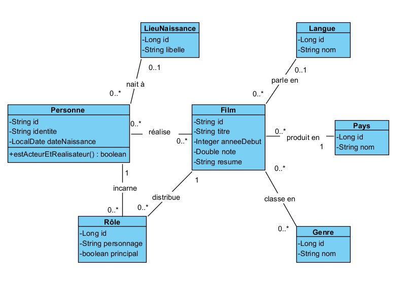
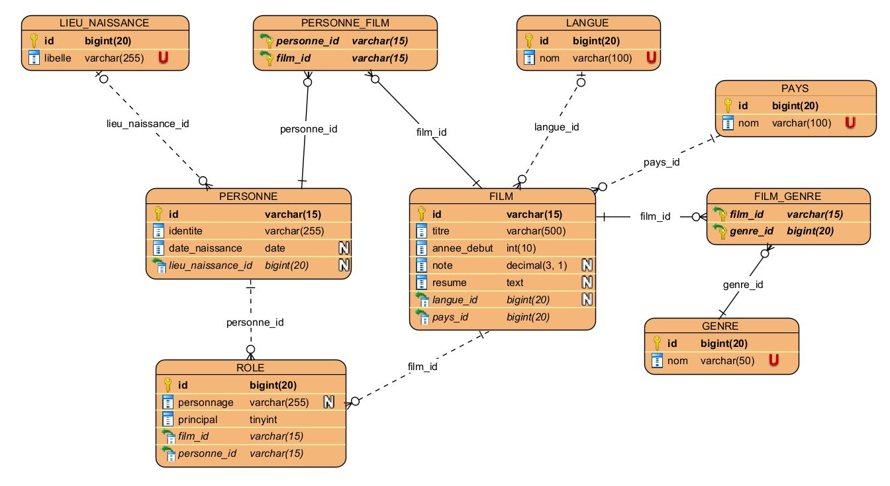

# Conception

Ce dossier regroupe les deux diagrammes de conception réalisés en amont du développement, avant l'écriture du modèle JPA.

## Diagramme de classes UML

Diagramme des 7 classes correspondant aux 7 entités du modèle (`Film`, `Personne`, `Role`, `Genre`, `Langue`, `Pays`, `LieuNaissance`).

## Modèle Physique de Données (MPD)

Diagramme figurant les relations entre les tables côté base de données, avec le détail des cardinalités (One-to-Many, Many-to-Many, etc.) entre chacune d'elles.
